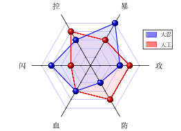
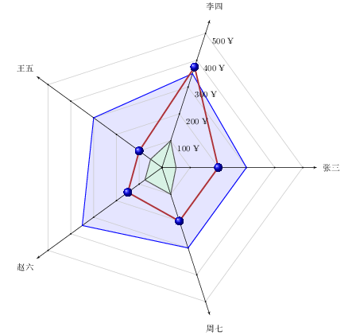
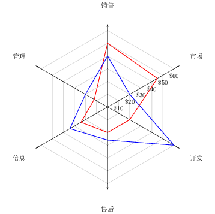
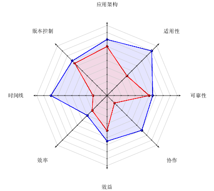
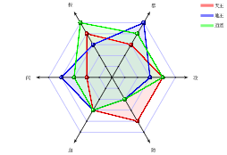

# radarchart.sty宏包

#### 项目介绍
这是一个根据" https://github.com/tkz-sty/tkz-kiviat "中修改出来的一个基于tikz绘制多维雷达图的宏包，用于在LaTeX中绘制多维雷达图。

在使用该自定义命令前，需要用：\usepackage{radarchart.sty}加载该"radarchart.sty"宏包。

#### 软件架构
1. 采用LaTeX撰写，需要ctex宏包支持中文、"radarchart.sty"宏包中已引入tikz宏包以支持绘图操作。
2. 如果采用数据文件生成雷达图，请注意数据文件需要符合"pgfplots"宏包的基本要求(请使用texdoc pgfplots查看使用说明)

#### 排版样例
1. 排版样例

2. 更多样例请参考"./examples"

#### 基本命令
在对原宏包定义的5条命令`\tkzRadarDiagram`、`\tkzRadarLine`、`\tkzRadarDiagramFromFile`、`\tkzRadarLineFromFile`和`\tkzRadarGrad`进行完善的基础上，添加了用于绘制雷达图图例的3条命令`\tkzRadarLegend`、`\tkzRadarLegendFromFile`和`\tkzLegendBox`，现该宏包共计8条命令，主要功能如下：

1. `\tkzRadarDiagram`命令：通过参数绘制雷达图网格。
2. `\tkzRadarLine`命令：通过参数绘制雷达图数据线。
3. `\tkzRadarLegend`命令：通过参数绘制带图例的雷达图。
4. `\tkzRadarDiagramFromFile`命令：通过读入文件数据绘制雷达图网格。
5. `\tkzRadarLineFromFile`命令：通过读入文件数据绘制雷达图数据线。
6. `\tkzRadarLegendFromFile`命令：通过读入文件数据绘制带图例的雷达图。
7. `\tkzRadarGrad`命令：这是一个辅助命令，用于在指定坐标轴上绘制单位刻度标记。
8. `\tkzLegendBox`命令：这是一个辅助命令，用于给`\tkzRadarLine`或`\tkzRadarLineFromFile`绘制的无图例雷达图添加图例。

#### 安装教程

1. 需要安装TexLive2018的跨平台LaTeX发行版。
2. 可以使用除Windows记事本外的任何文本编辑器编辑LaTeX代码。

#### 参与贡献

1. 本项目由西北农林科技大学信息工程学院耿楠创建和维护
2. 如果您愿意一同参与工作(不计报酬，免费自由)，请及时与作者联系
