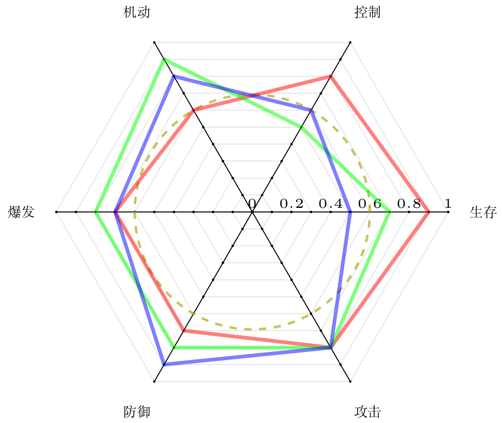

# radarchart自定义环境

#### 项目介绍
这是一个从"http://www.texample.net/tikz/examples/spiderweb-diagram/"中提取出来基于tikz的绘制多维雷达图的自定义环境，用于在LaTeX中绘制多维雷达图。

在使用该自定义环境前，需要用：\usepackage{tikz}加载该tikz宏包。

#### 软件架构
1. 采用LaTeX撰写，需要ctex宏包支持中文、tikz宏包支持绘图操作。

#### 排版样例
1. 排版样例

#### 安装教程

1. 需要安装TexLive2018的跨平台LaTeX发行版。
2. 可以使用除Windows记事本外的任何文本编辑器编辑LaTeX代码。

#### 参与贡献

1. 本项目由西北农林科技大学信息工程学院耿楠创建和维护
2. 如果您愿意一同参与工作(不计报酬，免费自由)，请及时与作者联系
